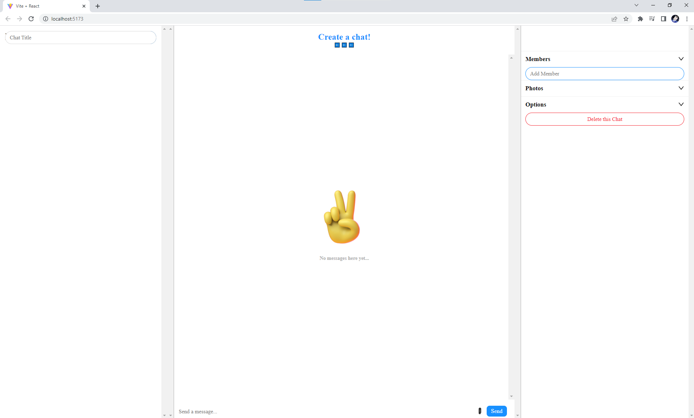
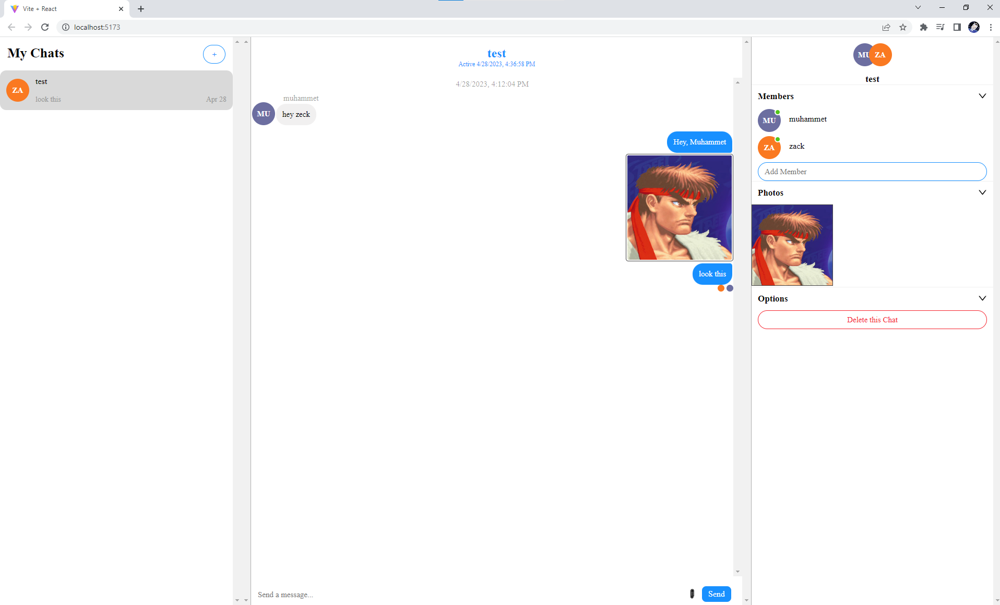
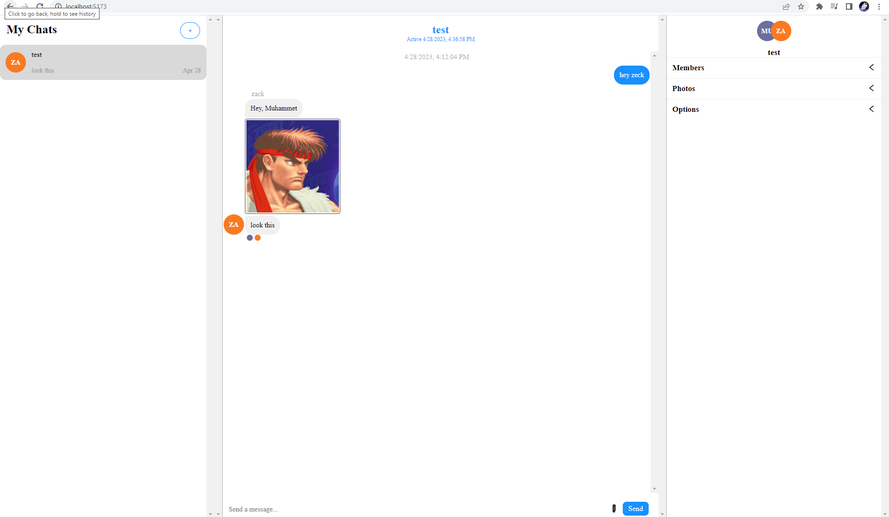

# Full-Stack Chat Project
### This project made by Muhammet Yayla with react.js, css, node.js and chatengine.io for server

 After download zip file for source code this project you have to do only these steps;
- Go to this website and signup for api key. (chatengine.io)
- Create new project in that website.
- ✨Use your own private key and project id in where i write your private key and project id in backend index.js and frontend ChatsPage.jsx files.
- After this open terminal in vscode and ```locate backend``` file write this ``` npm run start ```(It runs server)
- And again open terminal in vscode and ```locate frontend``` file write this ``` npm run dev ```(It runs client)
- If you get an error or something else you can watch this video -> [Realtime Chat Application](https://www.youtube.com/watch?v=Fzv-rgwcFKk&t=855s)
- All you need to do this. Enjoy it.

## Project Images




